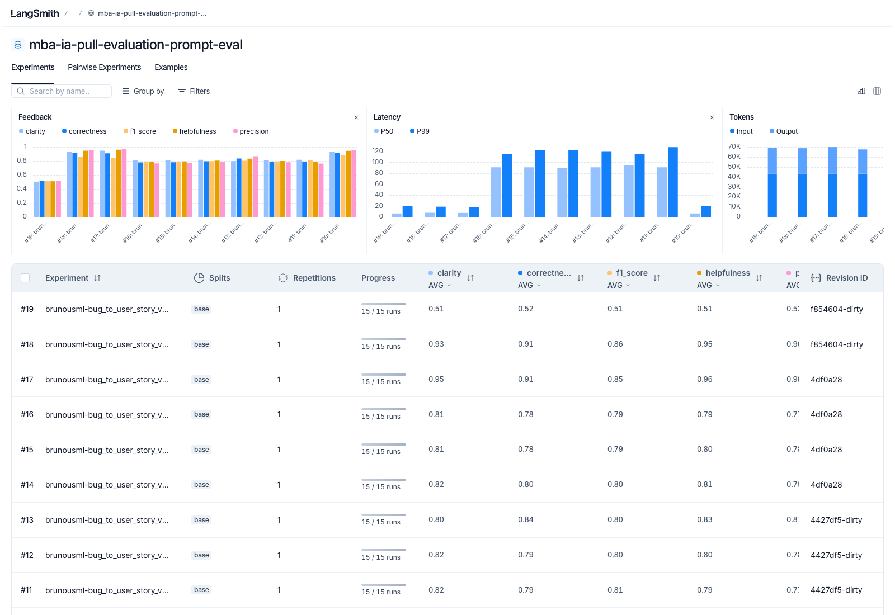

# Pull, Otimização e Avaliação de Prompts com LangChain e LangSmith

> [Ir para o processo de otimização e os resultados](#processo-de-otimização-e-resultados)

## Objetivo

Você deve entregar um software capaz de:

- Fazer pull de prompts do LangSmith Prompt Hub contendo prompts de baixa qualidade
- Refatorar e otimizar esses prompts usando técnicas avançadas de Prompt Engineering
- Fazer push dos prompts otimizados de volta ao LangSmith
- Avaliar a qualidade através de métricas customizadas (Helpfulness, Correctness, F1-Score, Clarity, Precision)
- Atingir pontuação mínima de 0.8 (80%) em todas as métricas de avaliação

## Exemplo no CLI

Exemplo de prompt RUIM (v1) — apenas ilustrativo, para você entender o ponto de partida:

```
==================================================
Prompt: {seu_username}/bug_to_user_story_v1
==================================================

Métricas Derivadas:
  - Helpfulness: 0.45 ✗
  - Correctness: 0.52 ✗

Métricas Base:
  - F1-Score: 0.48 ✗
  - Clarity: 0.50 ✗
  - Precision: 0.46 ✗

❌ STATUS: REPROVADO
⚠️  Métricas abaixo de 0.8: helpfulness, correctness, f1_score, clarity, precision
```

Exemplo de prompt OTIMIZADO (v2) — seu objetivo é chegar aqui:

```
# Após refatorar os prompts e fazer push
python src/push_prompts.py

# Executar avaliação
python src/evaluate.py

Executando avaliação dos prompts...
==================================================
Prompt: {seu_username}/bug_to_user_story_v2
==================================================

Métricas Derivadas:
  - Helpfulness: 0.94 ✓
  - Correctness: 0.96 ✓

Métricas Base:
  - F1-Score: 0.93 ✓
  - Clarity: 0.95 ✓
  - Precision: 0.92 ✓

✅ STATUS: APROVADO - Todas as métricas >= 0.8

Resultados no LangSmith (notas gravadas como feedback no experimento):
  {seu_username}/bug_to_user_story_v2
    https://smith.langchain.com/o/.../datasets/.../compare?selectedSessions=...
```

## Tecnologias obrigatórias

- Linguagem: Python 3.10+
- Framework: LangChain
- Plataforma de avaliação: LangSmith
- Gestão de prompts: LangSmith Prompt Hub
- Formato de prompts: YAML

## Pacotes recomendados

```python
from langsmith import Client  # Pull/push de prompts, datasets e avaliação
from langchain_core.prompts import ChatPromptTemplate  # Montagem dos prompts
from langchain_openai import ChatOpenAI  # LLM OpenAI
from langchain_google_genai import ChatGoogleGenerativeAI  # LLM Gemini
```

## OpenAI

- Crie uma API Key da OpenAI: https://platform.openai.com/api-keys
- Você vai precisar de um modelo de LLM para responder e de um modelo de LLM para avaliação. Consulte a documentação oficial da OpenAI para ver os modelos disponíveis.
- Custo estimado: ~$1-5 para completar o desafio

## Gemini (modelo free)

- Crie uma API Key da Google: https://aistudio.google.com/app/apikey
- Você vai precisar de um modelo de LLM para responder e de um modelo de LLM para avaliação. Consulte a documentação oficial do Google para ver os modelos disponíveis.
- Os limites de requisições gratuitas mudam com frequência. Consulte os limites atuais na documentação oficial do Google.

## Ollama (modelo local)

Não exige API key, não tem rate limit e não gera custo. O `utils.get_llm()` só conhece `openai` e `google`, mas o Ollama expõe uma API compatível com a da OpenAI, então basta usar o provider `openai` apontando para o servidor local:

1. Instale o [Ollama](https://ollama.com), baixe um modelo (`ollama pull <modelo>`) e confirme com `ollama list`.
2. No `.env`:

```
LLM_PROVIDER=openai
OPENAI_API_KEY=ollama                       # qualquer valor, o Ollama ignora
OPENAI_BASE_URL=http://localhost:11434/v1
LLM_MODEL=<modelo do ollama list>
EVAL_MODEL=<modelo do ollama list>
```

**Recursos necessários** (medidos com `qwen3.8:27b-mlx`, em um Apple M2 Ultra com 64 GB de memória unificada):

| Item | Valor |
|---|---|
| Disco | ~18 GB para o modelo (`qwen3.8:27b-mxfp8` ocupa ~31 GB) |
| Memória com o modelo carregado | ~21 GB (Ollama reportou 20,6 GB) |
| Memória recomendada | 32 GB ou mais, deixando folga para o sistema, o Python e o IDE |
| Plataforma | os modelos `-mlx` rodam em Mac com Apple Silicon |

- A mesma instância serve para gerar e para julgar (`LLM_MODEL` = `EVAL_MODEL`), então só um modelo fica carregado. Usar dois modelos diferentes soma a memória dos dois.
- Esses números são de uma máquina específica, e não um mínimo testado em hardware menor. Com menos memória, escolha um modelo menor (7B a 14B, por exemplo), sabendo que a qualidade como juiz tende a cair.
- Sem GPU ou Apple Silicon, o modelo roda na CPU e fica muito mais lento. São 60 chamadas por avaliação.

- Para voltar ao Gemini ou à OpenAI, remova `OPENAI_BASE_URL` e restaure `LLM_PROVIDER`, `LLM_MODEL` e `EVAL_MODEL`.
- Um modelo local costuma ser mais lento e julga com outra régua que o Gemini. Registre no README final quais modelos foram usados.
- Modelos de raciocínio podem emitir `<think>...</think>` na resposta, o que pode baixar as notas.

## Escolha dos modelos

Este desafio não fixa modelos. Nomes e versões mudam com frequência e alguns são descontinuados, então faz parte do desafio consultar a documentação oficial do provedor que você escolher, ver quais modelos estão disponíveis no momento e selecionar os que atendem ao objetivo. Você pode usar o mesmo modelo para responder e para avaliar, ou um modelo mais capaz na avaliação.

## Handle do LangSmith Hub (seu username)

O LangSmith identifica os prompts que você publica por um **handle público**, no
formato `handle/nome_do_prompt`. Esse handle é o valor que vai em
`USERNAME_LANGSMITH_HUB` no `.env`.

Ele **não existe por padrão**: é criado no momento em que você torna um prompt
público pela primeira vez. Por isso, faça esta etapa antes de tentar o push:

1. Abra o LangSmith e vá em **Prompts**
2. Crie um prompt qualquer (pode ser de teste) ou abra um que você já tenha
3. Clique nos **três pontinhos** no canto superior direito, ao lado do botão **Playground**
4. Escolha **Make Public**
5. Na tela **Choose your public handle**, defina o seu handle

O handle é **definitivo** depois de confirmado, então escolha com calma. Feito
isso, ele aparece no endereço do prompt (`handle/nome_do_prompt`) e é esse valor
que você coloca no `.env`.

## Requisitos

### 1. Pull do Prompt inicial do LangSmith

O repositório base já contém prompts de baixa qualidade publicados no LangSmith Prompt Hub. Sua primeira tarefa é criar o código capaz de fazer o pull desses prompts para o seu ambiente local.

Tarefas:

- Criar seu handle do LangSmith Hub (ver a seção "Handle do LangSmith Hub" acima)
- Configurar suas credenciais do LangSmith no arquivo .env (conforme o arquivo .env.example)
- Implementar o script src/pull_prompts.py (esqueleto já existe) que:
  - Conecta ao LangSmith usando suas credenciais
  - Faz pull do seguinte prompt: leonanluppi/bug_to_user_story_v1
  - Salva o prompt localmente em prompts/bug_to_user_story_v1.yml

Atenção: o LangSmith bloqueia por padrão o pull de prompts identificados por
`owner/nome`, porque um prompt do Hub é um objeto LangChain serializado e pode vir
de terceiros. Para o prompt semente do desafio, passe `dangerously_pull_public_prompt=True`
no `client.pull_prompt(...)`.

### 2. Otimização do Prompt

Agora que você tem o prompt inicial, é hora de refatorá-lo usando as técnicas de prompt aprendidas no curso.

Tarefas:

- Analisar o prompt em prompts/bug_to_user_story_v1.yml
- Criar um novo arquivo prompts/bug_to_user_story_v2.yml com suas versões otimizadas
- Aplicar obrigatoriamente Few-shot Learning (exemplos claros de entrada/saída) e pelo menos uma das seguintes técnicas adicionais:
  - Chain of Thought (CoT): Instruir o modelo a "pensar passo a passo"
  - Tree of Thought: Explorar múltiplos caminhos de raciocínio
  - Skeleton of Thought: Estruturar a resposta em etapas claras
  - ReAct: Raciocínio + Ação para tarefas complexas
  - Role Prompting: Definir persona e contexto detalhado
- Documentar no README.md quais técnicas você escolheu e por quê

Requisitos do prompt otimizado:

- Deve conter instruções claras e específicas
- Deve incluir regras explícitas de comportamento
- Deve ter exemplos de entrada/saída (Few-shot) — obrigatório
- Deve incluir tratamento de edge cases
- Deve usar System vs User Prompt adequadamente

### 3. Push e Avaliação

Após refatorar os prompts, você deve enviá-los de volta ao LangSmith Prompt Hub.

Tarefas:

- Implementar o script src/push_prompts.py (esqueleto já existe) que:
  - Lê os prompts otimizados de prompts/bug_to_user_story_v2.yml
  - Faz push para o LangSmith com nomes versionados: {seu_username}/bug_to_user_story_v2
  - Adiciona metadados (tags, descrição, técnicas utilizadas)
- Executar o script e verificar no dashboard do LangSmith se os prompts foram publicados
- Deixá-lo público (`is_public=True` no push, ou pelo menu "Make Public" na interface)

Lembre-se de que `{seu_username}` é o handle do Hub, e ele só existe depois de você
ter tornado algum prompt público pelo menos uma vez.

### 4. Iteração

Espera-se 3-5 iterações.

- Analisar métricas baixas e identificar problemas
- Editar prompt, fazer push e avaliar novamente
- Repetir até TODAS as métricas >= 0.8

Cada execução do `src/evaluate.py` cria um **experimento** no LangSmith, ligado ao
dataset de avaliação. As 5 notas são gravadas como feedback em cada exemplo, o que
permite comparar suas iterações lado a lado no dashboard. Ao final, o script imprime
o link direto do experimento.

```
Critério de Aprovação:
- Helpfulness >= 0.8
- Correctness >= 0.8
- F1-Score >= 0.8
- Clarity >= 0.8
- Precision >= 0.8

MÉDIA das 5 métricas >= 0.8
```

IMPORTANTE: TODAS as 5 métricas devem estar >= 0.8, não apenas a média!

### 5. Testes de Validação

O que você deve fazer: Edite o arquivo tests/test_prompts.py e implemente, no mínimo, os 6 testes abaixo usando pytest:

- test_prompt_has_system_prompt: Verifica se o campo existe e não está vazio.
- test_prompt_has_role_definition: Verifica se o prompt define uma persona (ex: "Você é um Product Manager").
- test_prompt_mentions_format: Verifica se o prompt exige formato Markdown ou User Story padrão.
- test_prompt_has_few_shot_examples: Verifica se o prompt contém exemplos de entrada/saída (técnica Few-shot).
- test_prompt_no_todos: Garante que você não esqueceu nenhum [TODO] no texto.
- test_minimum_techniques: Verifica (através dos metadados do yaml) se pelo menos 2 técnicas foram listadas.

Como validar:

```
pytest tests/test_prompts.py
```

## Estrutura obrigatória do projeto

Faça um fork do repositório base: https://github.com/devfullcycle/mba-ia-pull-evaluation-prompt

```
mba-ia-pull-evaluation-prompt/
├── .env.example              # Template das variáveis de ambiente
├── requirements.txt          # Dependências Python
├── README.md                 # Sua documentação do processo
│
├── prompts/
│   ├── bug_to_user_story_v1.yml  # Prompt inicial (já incluso)
│   └── bug_to_user_story_v2.yml  # Seu prompt otimizado (criar)
│
├── datasets/
│   └── bug_to_user_story.jsonl   # 15 exemplos de bugs (já incluso)
│
├── src/
│   ├── pull_prompts.py       # Pull do LangSmith (implementar)
│   ├── push_prompts.py       # Push ao LangSmith (implementar)
│   ├── evaluate.py           # Avaliação automática (pronto)
│   ├── metrics.py            # 5 métricas implementadas (pronto)
│   └── utils.py              # Funções auxiliares (pronto)
│
├── tests/
│   └── test_prompts.py       # Testes de validação (implementar)
```

O que você deve implementar:

- prompts/bug_to_user_story_v2.yml — Criar do zero com seu prompt otimizado
- src/pull_prompts.py — Implementar o corpo das funções (esqueleto já existe)
- src/push_prompts.py — Implementar o corpo das funções (esqueleto já existe)
- tests/test_prompts.py — Implementar os 6 testes de validação (esqueleto já existe)
- README.md — Documentar seu processo de otimização

O que já vem pronto (não alterar):

- src/evaluate.py — Script de avaliação completo (cria o experimento no LangSmith e grava as notas como feedback)
- src/metrics.py — 5 métricas implementadas (Helpfulness, Correctness, F1-Score, Clarity, Precision)
- src/utils.py — Funções auxiliares
- datasets/bug_to_user_story.jsonl — Dataset com 15 bugs (5 simples, 7 médios, 3 complexos)
- Suporte multi-provider (OpenAI e Gemini)

## VirtualEnv para Python

Crie e ative um ambiente virtual antes de instalar dependências:

```
python3 -m venv venv
source venv/bin/activate  # No Windows: venv\Scripts\activate
pip install -r requirements.txt
```

## Ordem de execução

1. Executar pull dos prompts ruins

```
python src/pull_prompts.py
```

2. Refatorar prompts

Edite manualmente o arquivo prompts/bug_to_user_story_v2.yml aplicando as técnicas aprendidas no curso.

3. Fazer push dos prompts otimizados

```
python src/push_prompts.py
```

4. Executar avaliação

```
python src/evaluate.py
```

## Entregável

1. Repositório público no GitHub (fork do repositório base) contendo:

- Todo o código-fonte implementado
- Arquivo prompts/bug_to_user_story_v2.yml 100% preenchido e funcional
- Arquivo README.md atualizado

2. README.md deve conter:

A) Seção "Técnicas Aplicadas (Fase 2)":

- Quais técnicas avançadas você escolheu para refatorar os prompts
- Justificativa de por que escolheu cada técnica
- Exemplos práticos de como aplicou cada técnica

B) Seção "Resultados Finais":

- Link público do dataset de avaliação, com os experimentos (ver "Evidências no LangSmith")
- Screenshots das avaliações com as notas mínimas de 0.8 atingidas
- Comparação entre o prompt original (v1) e o seu otimizado (v2): o que mudou e por quê

C) Seção "Como Executar":

- Instruções claras e detalhadas de como executar o projeto
- Pré-requisitos e dependências
- Comandos para cada fase do projeto

3. Evidências no LangSmith:

- Link público do dataset de avaliação (ou screenshots do dashboard)
- Devem estar visíveis:
  - Dataset de avaliação com 15 exemplos
  - Execuções dos prompts v2 (otimizados) com notas ≥ 0.8
  - Tracing detalhado de pelo menos 3 exemplos

O link que o `src/evaluate.py` imprime ao final só abre para quem tem acesso ao seu
workspace. Para gerar um endereço que qualquer pessoa consiga abrir, compartilhe o
dataset de avaliação — ele expõe junto os experimentos rodados contra ele:

```python
from langsmith import Client

print(Client().share_dataset(dataset_name="<seu LANGSMITH_PROJECT>-eval")["url"])
```

Rode uma vez e guarde o endereço: ao compartilhar de novo, o link muda.

## Dicas Finais

- Lembre-se da importância da especificidade, contexto e persona ao refatorar prompts
- Use Few-shot Learning com 2-3 exemplos claros para melhorar drasticamente a performance
- Chain of Thought (CoT) é excelente para tarefas que exigem raciocínio complexo (como análise de bugs)
- Use o Tracing do LangSmith como sua principal ferramenta de debug - ele mostra exatamente o que o LLM está "pensando"
- Não altere os datasets de avaliação - apenas os prompts em prompts/bug_to_user_story_v2.yml
- Itere, itere, itere - é normal precisar de 3-5 iterações para atingir 0.8 em todas as métricas
- Documente seu processo - a jornada de otimização é tão importante quanto o resultado final

## Processo de Otimização e Resultados

Técnicas aplicadas, resultados das avaliações e instruções de execução desta entrega.

### A) Técnicas Aplicadas (Fase 2)

O prompt v1 era um parágrafo genérico: sem persona, sem formato, sem exemplos, e com `{bug_report}` duplicado no system e no user prompt. O v2 (`prompts/bug_to_user_story_v2.yml`) usa três técnicas.

#### 1. Few-shot Learning (obrigatória)

**Por quê:** o dataset tem três níveis de complexidade, cada um com um formato de saída diferente. Descrever esses formatos só com texto deixa muita margem; exemplos mostram o formato exato.

**Como:** três exemplos completos de entrada e saída, um por nível:

- **Simples:** uma frase "Como um..., eu quero..., para que..." e um cenário Dado/Quando/Então.
- **Médio:** o mesmo, mais a seção "Contexto Técnico" (erro registrado, causa provável, correção sugerida).
- **Complexo:** formato com `=== USER STORY PRINCIPAL ===`, critérios por problema, critérios técnicos, contexto do bug, tasks em fases, métricas de sucesso e contexto do negócio.

#### 2. Role Prompting

**Por quê:** a persona define o ponto de vista. Uma User Story deve falar da necessidade do usuário, e não do defeito técnico.

**Como:** o prompt abre com "Você é uma Product Manager sênior, com 10 anos de experiência em produtos digitais (e-commerce, SaaS, mobile e ERP)". As regras de comportamento reforçam isso: o perfil do "Como um" é quem sofre o impacto, a meta descreve a necessidade (e não o sintoma) e o benefício vem em uma só ideia.

#### 3. Chain of Thought (raciocínio interno)

**Por quê:** o bug precisa ser classificado (simples, médio ou complexo) antes de escolher o formato, e relatos com vários problemas não podem perder nenhum.

**Como:** uma lista de passos que o modelo executa sem mostrar: identificar quem é afetado, a necessidade, o valor, todos os problemas distintos, os dados concretos (números, IDs, endpoints) e a complexidade. A saída traz **somente** a User Story, sem o raciocínio, para não poluir a avaliação.

#### Outras decisões

- **System vs User:** instruções, regras e exemplos ficam no system prompt. O user prompt só carrega `{bug_report}`, sem duplicação.
- **Edge cases:** regras explícitas para relatos curtos e vagos (não inventar dados), vários problemas (cobrir todos) e bugs simples (não acrescentar cenários que o relato não cita).
- **Não inventar:** números, versões e métricas só podem vir do relato. Sugestões técnicas são tratadas como recomendações, e não como fatos.

### B) Resultados Finais

#### Modelos usados

O desafio não fixa modelos. Foram usados dois juízes diferentes, e as notas **não são comparáveis entre si**:

| Juiz | Modelo | Observação |
|---|---|---|
| Ollama local | `qwen3.8:27b-mlx` (gerador e juiz) | Mais rigoroso: o v2 fica perto de 0.80 |
| Gemini | `gemini-2.5-flash` (gerador e juiz) | Mais brando: o v2 fica perto de 0.93 |

O `gemini-3.5-flash-lite` foi descartado porque devolve `content` como lista de blocos, que o `metrics.py` (que não pode ser alterado) não consegue ler, e todas as notas saíram 0.00. O `gemini-2.5-flash` devolve texto simples e funciona.

#### Notas do v2 (prompt atual, `gemini-2.5-flash`)

| Métrica | Rodada 1 | Rodada 2 |
|---|---|---|
| Helpfulness | 0.96 ✓ | 0.95 ✓ |
| Correctness | 0.91 ✓ | 0.91 ✓ |
| F1-Score | 0.85 ✓ | 0.86 ✓ |
| Clarity | 0.95 ✓ | 0.93 ✓ |
| Precision | 0.98 ✓ | 0.96 ✓ |
| **Média** | **0.9295** | **0.9240** |
| Status | ✅ Aprovado | ✅ Aprovado |

**Limitação:** foram planejadas 3 rodadas, mas a terceira falhou por `429 RESOURCE_EXHAUSTED` (limite de gasto mensal do projeto no Google AI Studio). Todas as chamadas dos juízes falharam e o experimento ficou com notas ~0.51 de fallback, que não refletem o prompt. Só as 2 rodadas acima são válidas.

#### Histórico de iterações (juiz Ollama)

Com o juiz local, mais rigoroso, o v2 ficou na margem da aprovação, e duas tentativas de melhora pioraram o resultado:

| Versão | Média geral | Resultado |
|---|---|---|
| v2 base (3 rodadas extras + 1ª) | 0.809 | 3 de 4 execuções aprovadas (margem ~0.003) |
| Iteração 1 (ajustes A1 a A4) | 0.816 | Reprovou nas 3: F1 caiu para 0.750 |
| Iteração 2 (A3 relaxado, seções de tasks e métricas) | 0.795 | Reprovou nas 3: Precision caiu para ~0.780 |

Os comentários dos juízes em cada exemplo, lidos no LangSmith, mostraram o padrão: um trade-off entre Precision e Recall: cortar o que o relato não cita sobe a Precision e derruba o F1, e o contrário também vale. O prompt atual (iteração 2) é o que aprova com folga no juiz Gemini; no juiz Ollama a versão mais estável foi a base.

#### Comparação v1 × v2

| Aspecto | v1 | v2 |
|---|---|---|
| Persona | "um assistente" genérico | Product Manager sênior |
| Exemplos | nenhum | 3 (simples, médio, complexo) |
| Formato de saída | não definido | um formato por nível de complexidade |
| `{bug_report}` | duplicado em system e user | só no user prompt |
| Regras de comportamento | nenhuma | cobrir todos os problemas, não inventar dados, benefício em uma ideia |
| Raciocínio | não orientado | passos internos, saída só com a User Story |
| Edge cases | não tratados | relatos curtos, vários problemas, bugs simples |

#### Evidências no LangSmith

- Dataset de avaliação: `{LANGSMITH_PROJECT}-eval`, com 15 exemplos.
- Experimentos do v2 com Gemini: `0ac5088d-b499-4b49-b815-9f9e4f292f5f` (rodada 1) e `f3b79d64-879e-44c0-8c6f-2a8a4e345ced` (rodada 2).
- Link público do dataset (15 exemplos e os experimentos): https://smith.langchain.com/public/38a6af54-346e-40a0-bc0a-8997dc790cf8/d
  - O link expõe todos os experimentos do dataset, inclusive os reprovados (Ollama, iterações 1 e 2) e a rodada 3 do Gemini, inválida por limite de gasto (`feb6084d-5c71-4a22-a971-c22425ced9da`).
- Prompt público no Hub: `brunousml/bug_to_user_story_v2`.
- Screenshot da tabela de experimentos do dataset público (`screenshots/dataset-publico.png`):

  

  - **#17 e #18** são as rodadas válidas do v2 com Gemini (médias 0.9295 e 0.9240, todas as métricas ≥ 0.8). O revision `4df0a28` é o commit do prompt avaliado; o `f854604-dirty` do #18 é só o estado do repositório na hora da execução, e o prompt é o mesmo.
  - **#19** é a rodada 3, inválida (limite de gasto do Gemini, notas ~0.51).
  - **#10 a #16** são as rodadas com o juiz Ollama, mais rigoroso, das iterações 1 e 2.
  - A captura mostra só a lista de experimentos. Os traces por exemplo estão no link público, dentro de cada experimento.

### C) Como Executar

#### Pré-requisitos

- Python 3.10 ou superior
- Conta no [LangSmith](https://smith.langchain.com) com API key e um **handle público** (o username do Hub). Ele só existe depois de tornar um prompt público: em LangSmith > Prompts, abra um prompt, menu dos três pontinhos > "Make Public" e defina o handle (é definitivo)
- Uma chave de LLM (Google Gemini ou OpenAI) **ou** o [Ollama](https://ollama.com) instalado

#### Instalação

```bash
python3 -m venv venv
source venv/bin/activate   # Windows: venv\Scripts\activate
pip install -r requirements.txt
cp .env.example .env       # e preencha os valores
```

#### Configuração do `.env`

Variáveis principais: `LANGSMITH_API_KEY`, `LANGSMITH_PROJECT` (usado também no nome do dataset `{LANGSMITH_PROJECT}-eval`), `USERNAME_LANGSMITH_HUB`, `LLM_PROVIDER` (`google` ou `openai`), `LLM_MODEL` e `EVAL_MODEL`, mais a chave do provider escolhido.

- **Gemini:** use um modelo que devolva `content` como texto (por exemplo `gemini-2.5-flash`). Modelos da família 3.x devolvem lista de blocos e zeram as notas.
- **Ollama:** `LLM_PROVIDER=openai`, `OPENAI_API_KEY=ollama`, `OPENAI_BASE_URL=http://localhost:11434/v1` e `LLM_MODEL`/`EVAL_MODEL` com o nome do `ollama list`. Medido com `qwen3.8:27b-mlx` em um M2 Ultra de 64 GB: ~18 GB de disco e ~21 GB de memória. Com menos memória, use um modelo menor, sabendo que a qualidade como juiz tende a cair.

#### Fases

```bash
# 1. Pull do prompt inicial (leonanluppi/bug_to_user_story_v1)
python src/pull_prompts.py

# 2. Edite prompts/bug_to_user_story_v2.yml (já incluso nesta entrega)

# 3. Push do prompt otimizado para {USERNAME_LANGSMITH_HUB}/bug_to_user_story_v2
python src/push_prompts.py

# 4. Avaliação (cria um experimento no LangSmith e imprime o link)
python src/evaluate.py

# 5. Testes de validação do prompt
pytest tests/test_prompts.py
```

O `push_prompts.py` retorna `409 Nothing to commit` se o conteúdo não mudou desde o último push. Não é erro.

#### Link público do dataset

```python
from langsmith import Client

print(Client().share_dataset(dataset_name="<seu LANGSMITH_PROJECT>-eval")["url"])
```

Compartilhar expõe **todos** os experimentos do dataset, inclusive os reprovados. Rode uma vez e guarde o endereço, porque o link muda a cada compartilhamento.

#### Observação sobre o dataset

O `evaluate.py` mostra `Erro ao parsear JSONL ... line 1 column 2` ao ler `datasets/bug_to_user_story.jsonl`. Não afeta a nota quando o dataset `{LANGSMITH_PROJECT}-eval` já existe no LangSmith com os 15 exemplos. Só atrapalha quem recriar o dataset do zero.
