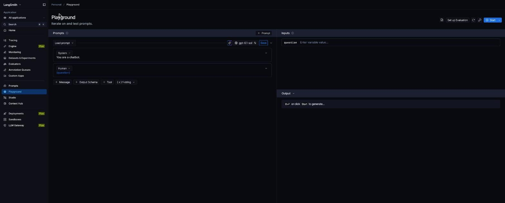
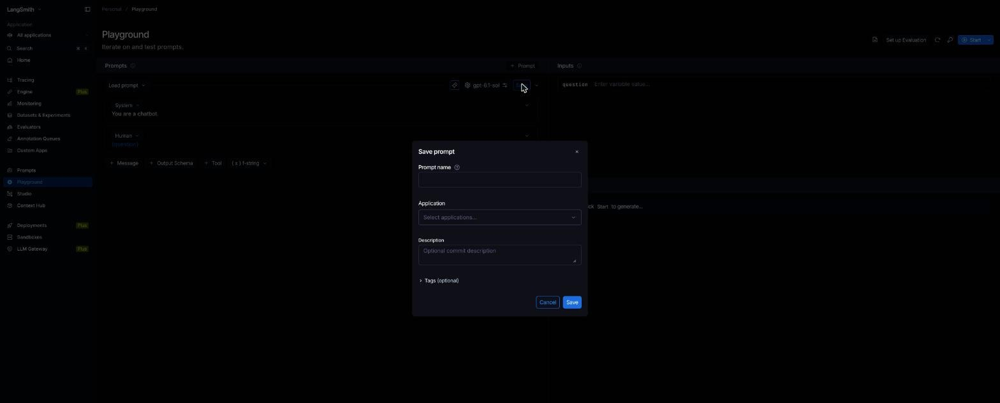
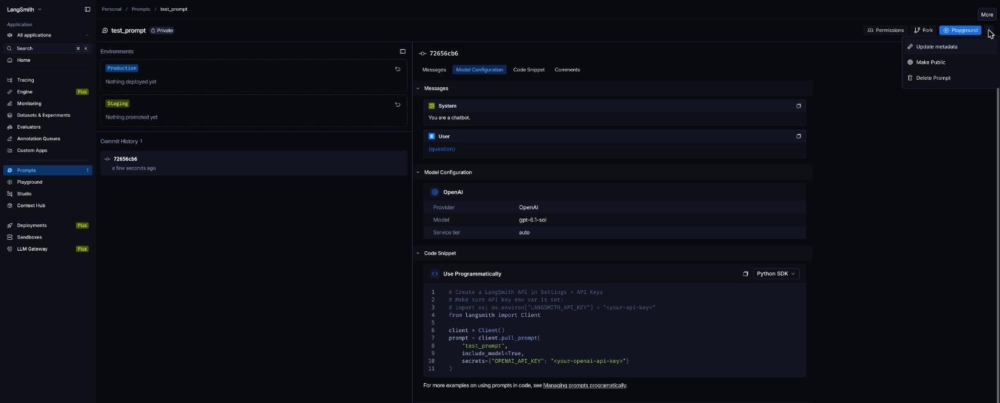

# Como obter o `USERNAME_LANGSMITH_HUB`

O `USERNAME_LANGSMITH_HUB` é o **handle público** do LangSmith Hub. Ele só é criado quando você torna um prompt público pela primeira vez. Por isso o caminho é: criar um prompt, tornar público e definir o handle.

## Passo 1: Abra a seção Prompts

Acesse https://smith.langchain.com, entre na conta e clique em **Prompts** no menu lateral. Se você nunca criou um prompt, a lista aparece vazia.


## Passo 2: Crie um prompt

Clique em **+ Prompt**. Isso abre o **Playground** com um prompt padrão (`System: You are a chatbot.` e `Human: {question}`). Esse conteúdo serve, pois o prompt é só um meio de criar o handle.



## Passo 3: Salve o prompt

Clique em **Save**, preencha o **Prompt name** (por exemplo `test_prompt`) e clique em **Save** de novo. Os outros campos são opcionais.



Aparece o aviso "Prompt created". Ele nasce como **Private**.

## Passo 4: Abra o prompt e escolha "Make Public"

1. Em **Prompts**, clique no nome do prompt criado.
2. No canto superior direito, clique nos **três pontinhos (More)**.
3. Escolha **Make Public**.



## Passo 5: Defina o handle

Na tela **"Choose your public handle"**, digite o handle que você quer e confirme.

> **Atenção:** o handle é definitivo depois de confirmado. Escolha com calma.

## Passo 6: Coloque o handle no `.env`

```env
USERNAME_LANGSMITH_HUB=seu_handle
```

Os prompts que você publicar ficam no formato `seu_handle/nome_do_prompt`, por exemplo `seu_handle/bug_to_user_story_v2`.

## Verificação

```bash
source venv/bin/activate
python -c "from dotenv import load_dotenv; import os; load_dotenv(); print(os.getenv('USERNAME_LANGSMITH_HUB'))"
```

Se imprimir `None`, o valor não foi salvo no `.env`.

## Observações

- O prompt de teste pode ser apagado depois, em **More > Delete Prompt**. O handle continua seu.
- Você também vai precisar da `LANGSMITH_API_KEY` (em **Settings > API Keys** no LangSmith).
